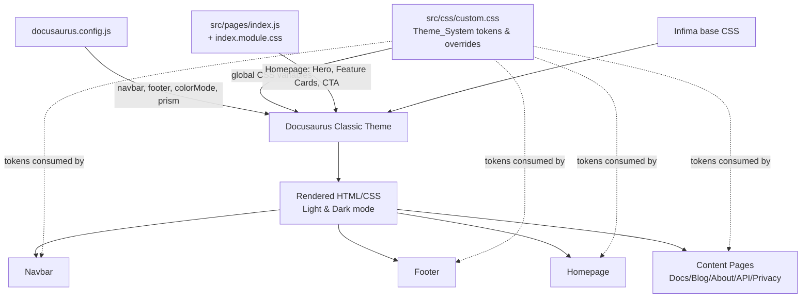
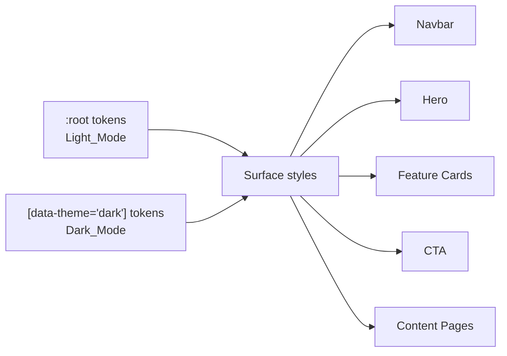

# Design Document

## Overview

This design describes a complete graphic and UI restyling of the Aria Watch website. The work is presentational: it reshapes the global theme, the homepage, navigation chrome, and content pages without changing site content, routing, or backend behavior.

The site is a Docusaurus 3.7.0 static site using the classic preset, React 19, and Infima (Docusaurus's built-in CSS framework). The restyle is delivered primarily through three levers that Docusaurus exposes:

1. **Global CSS custom properties and overrides** in `src/css/custom.css` — the single source of truth for the color palette, typography, spacing, and radius scales (the `Theme_System`).
2. **Theme configuration** in `docusaurus.config.js` — navbar items, footer link groups, copyright, and Prism syntax-highlighting themes.
3. **Page and component styles** — `src/pages/index.js` + `index.module.css` (Homepage hero, feature cards, CTA) and the supporting CSS modules.

The central design decision is to centralize all visual tokens (colors, fonts, spacing, radii) as CSS custom properties scoped to `:root` (Light_Mode) and `[data-theme='dark']` (Dark_Mode), and to drive every styled surface from those tokens. This guarantees palette/typography consistency (Requirement 1, 2, 8) and makes light/dark parity a matter of redefining the same token set under the dark selector.

Docusaurus already provides several behaviors the requirements depend on, so the design leans on built-in mechanisms rather than reimplementing them:

- **Theme toggle, persistence, and default mode** — Docusaurus `colorMode` config and its `localStorage`-backed theme switcher handle Requirement 2.3, 2.5, 2.6, 2.7. We configure it; we do not rewrite it.
- **Mobile navbar menu** — Docusaurus ships a responsive hamburger menu (Requirement 6.6).
- **Keyboard focus and link/button semantics** — native HTML elements emitted by Docusaurus give us baseline tab order and Enter/Space activation (Requirement 11); we restyle the focus indicator rather than replace focus handling.

### Research Notes

- **Infima theming**: Docusaurus's classic theme is built on Infima, which is itself token-driven via `--ifm-*` CSS variables (e.g., `--ifm-color-primary`, `--ifm-font-family-base`, `--ifm-navbar-background-color`, `--ifm-spacing-*`). Overriding these in `custom.css` is the supported, upgrade-safe way to restyle the whole site. The existing `custom.css` already overrides the primary color ramp and font families, confirming this approach. ([Docusaurus styling docs](https://docusaurus.io/docs/styling-layout))
- **Color mode**: Docusaurus exposes `themeConfig.colorMode` with `defaultMode`, `disableSwitch`, and `respectPrefersColorScheme`. Setting `defaultMode: 'light'` and `respectPrefersColorScheme: false` satisfies the "default to Light_Mode" requirements (2.6) deterministically. The switcher persists the selection in `localStorage` under the `theme` key and restores it on navigation/reload (2.5), and corrupt/missing values fall back to the default (2.7). ([Docusaurus colorMode API](https://docusaurus.io/docs/api/themes/configuration#color-mode))
- **Prism syntax themes**: `themeConfig.prism.theme` and `prism.darkTheme` already select GitHub (light) and Dracula (dark). These satisfy Requirement 8.2/8.5 once contrast is verified; both are high-contrast, widely-used themes.
- **Icons**: The project depends on FontAwesome (via `font-awesome` 4.7 CSS classes used in the navbar `html` items) and `react-icons`. The `Icon_Set` (Requirement 9.1) is the union of these. We standardize on FontAwesome for navbar/affordance icons (already in use) and may use `react-icons` within React components (hero/feature/CTA) for consistency.
- **Contrast**: WCAG 2.1 AA contrast (Requirement 1.5/1.6, 2.4, and the per-section contrast clauses) is a property of chosen palette token pairs. The design fixes contrast at the token level by choosing text/background pairs whose computed ratio meets the threshold, rather than per-element overrides.

## Architecture

The restyle has no runtime services; the "architecture" is the layering of styling concerns and how Docusaurus composes them at build time.



### Token Cascade



Design principles:

- **Single source of truth**: Every color, font, spacing, and radius value used by a styled surface resolves to a CSS custom property defined in `custom.css`. No hard-coded hex values in module CSS for theme roles. (This directly retires the current hard-coded colors in `index.module.css`, e.g. `#f7f7f7`, `#217a2b`, `#dbe4c9`.)
- **Mode parity by token redefinition**: Light and dark differ only in the values assigned to the same token names, so any surface that consumes tokens automatically adapts on toggle.
- **Lean on the platform**: Theme switching, persistence, mobile menu, routing, and link semantics come from Docusaurus. The restyle changes appearance, not these behaviors.
- **Responsive via CSS only**: Layout adaptation uses CSS media queries keyed to the three defined breakpoints; no JS layout logic.

## Components and Interfaces

### 1. Theme_System (`src/css/custom.css`)

The core token layer. Defines and applies the design tokens.

**Token groups (CSS custom properties):**

- **Color roles** (per mode): `--aw-color-primary`, `--aw-color-accent`, `--aw-color-surface`, `--aw-color-background`, `--aw-color-text`. Mapped onto the corresponding `--ifm-*` variables so Infima-rendered surfaces (navbar, footer, content) inherit them.
- **Typography**: `--ifm-heading-font-family` (Space Grotesk), `--ifm-font-family-base` (Inter), `--ifm-font-family-monospace` (JetBrains Mono). Already present; retained.
- **Spacing scale**: `--aw-space-1` … `--aw-space-5` (≥4 steps), e.g. 0.25/0.5/1/1.5/2 rem.
- **Radius scale**: `--aw-radius-sm`, `--aw-radius-md`, `--aw-radius-lg` (≥3 steps).

**Interface**: These tokens are consumed by all module CSS and by Infima overrides. Defined twice: under `:root` for Light_Mode and `[data-theme='dark']` for Dark_Mode.

### 2. Homepage (`src/pages/index.js`, `src/pages/index.module.css`)

Restyles the three homepage sections. Component structure stays close to current code.

- **Hero_Section** (`<header className={styles.heroBanner}>`): title (`Aria Watch`), tagline, one primary control ("Get Started" → `/docs`), one secondary control ("Learn More" → `/about`). Background image retained with a gradient overlay; text color and button styling pull from tokens to guarantee ≥4.5:1 contrast in both modes (Requirement 3.2/3.3). Primary vs. secondary buttons differentiated by ≥2 visual attributes with ≥3:1 inter-control contrast (3.4).
- **Feature_Cards** (`Feature` component): each card has one image/icon, one title, one description. Uniform padding (`--aw-space-*`) and radius (`--aw-radius-*`) across cards (4.2). Hover state (elevation/scale change) with ≤200ms transition (4.3/4.4). Responsive grid: 1 column mobile (4.5), multi-column equal-height tablet (4.6), single equal-height row desktop (4.7) — implemented with flexbox `align-items: stretch` + media queries.
- **CTA_Section**: heading, supporting text, single action control linking to the GitHub contribution destination, opening in a new tab with `rel="noopener noreferrer"` (5.3). Visible focus indicator (5.4). Disabled state when destination is unconfigured (5.5) — see Data Models for how the destination is sourced.

### 3. Navbar (`docusaurus.config.js` + `custom.css`)

- Five primary items in order: About, Blog, Docs, App, API (Requirement 6.1) — already configured; verify order.
- Logo links home (6.2, Docusaurus default).
- GitHub + Instagram external icon links open in new tab (6.3).
- Hover and focus states styled via `custom.css` token-driven rules (6.4/6.5/6.7).
- Mobile menu via Docusaurus default (6.6).

### 4. Footer (`docusaurus.config.js` + `custom.css`)

- Three link groups (Docs, Community, More), each with heading + ≥1 link (7.1) — already configured.
- Copyright contains "Aria Watch" + current year via `new Date().getFullYear()` (7.2) — already present.
- Token-driven contrast, hover state, and responsive column/row layout (7.3–7.6).

### 5. Content Pages

Docs, Blog, About (`about.mdx`), API (`api.js` + `api.module.css`), Privacy (`privacy.md`). These render through Docusaurus layouts and automatically consume the global tokens. `api.module.css` is audited to replace any hard-coded theme colors with tokens (8.1, 8.3). Prism themes handle code contrast (8.2/8.4/8.5).

### 6. Iconography (`Icon_Set`)

FontAwesome (navbar, affordances) and react-icons (React components). Meaningful images get descriptive `alt` (1–125 chars); decorative images get `alt=""`; meaning-bearing icons get an accessible label (Requirement 9.2–9.4). Images use `object-fit` to preserve aspect ratio (9.5) and reserve layout space on load failure (9.6/12.5).

## Data Models

This is a presentational feature with no persistent domain data. The "data" consists of design tokens and a small set of configuration values.

### Design Token Model (conceptual)

```
ColorPalette (per mode: Light | Dark)
  primary     : color
  accent      : color
  surface     : color
  background  : color
  text        : color

Typography
  headingFont : font-family   // Space Grotesk
  bodyFont    : font-family   // Inter
  monoFont    : font-family   // JetBrains Mono

SpacingScale  : [s1, s2, s3, s4, (s5)]   // >= 4 steps
RadiusScale   : [rSm, rMd, rLg]          // >= 3 steps
```

Each `ColorPalette` role has exactly one value per mode (Requirement 1.1). Text/background role pairs are selected so computed contrast meets WCAG AA (1.5, 2.4).

### Configuration Values

- **Theme color mode**: `themeConfig.colorMode = { defaultMode: 'light', disableSwitch: false, respectPrefersColorScheme: false }`.
- **Navbar items**: ordered list (About, Blog, Docs, App, API) + external links (GitHub, Instagram).
- **Footer link groups**: Docs, Community, More.
- **Prism themes**: `{ theme: github, darkTheme: dracula }`.
- **Contribution destination**: the CTA target URL (`https://github.com/Aria-Watch/Aria-Watch-Borino-PCB`). Treated as a single configured value; an empty/unset value triggers the CTA disabled state (Requirement 5.5).

### New Dependencies

Any new styling/icon library introduced MUST be pinned to an exact version in `package.json` (Requirement 12.3). The current plan does not require new libraries; existing FontAwesome + react-icons cover the `Icon_Set`. If a font or icon package is added, it will be pinned exactly (no `^`, `~`, `>`, `*`).

## Error Handling

Because the feature is static and presentational, error handling focuses on graceful degradation and build integrity rather than runtime exception handling.

- **Asset load failure (images/icons)**: Meaningful images render their `alt` text and retain reserved layout space (CSS sizing on the container) so adjacent content does not reflow or overlap (Requirement 9.6, 12.5). Decorative images with empty `alt` simply collapse without breaking layout.
- **Missing/invalid stored theme**: Handled by Docusaurus `colorMode` — a missing or unrecognized stored value falls back to `defaultMode: 'light'` and the stored value is normalized (Requirement 2.7).
- **Unconfigured CTA destination**: When the contribution destination is empty/unset, the CTA action control renders in a disabled, non-activatable state and signals unavailability to the visitor (Requirement 5.5). Implemented by conditionally rendering a disabled element (no `href`, `aria-disabled="true"`) when the URL value is falsy.
- **Build failure**: The Docusaurus build (`npm run build`) fails fast on errors and broken links (`onBrokenLinks: 'throw'`). On failure it exits non-zero and the previous build output is left untouched (Requirement 12.1, 12.2). CI/local verification treats any error-level output as a failure.
- **Contrast fallback**: If a text element resolves below the AA threshold against its effective background, the design assigns the mode's text-role token chosen to satisfy the threshold (Requirement 1.6). This is enforced at design time by token selection and verified by audit, not by runtime branching.

## Testing Strategy

### Applicability of Property-Based Testing

Property-based testing is **not appropriate** for this feature. The work is UI restyling: CSS custom properties, Docusaurus theme configuration, responsive layout, and React component presentation. Per standard guidance, UI rendering and layout are validated with snapshot, visual-regression, example, and accessibility checks rather than property-based tests. There are no pure functions with a large input space and universal "for all inputs" properties to assert — the behaviors are either (a) declarative styling/config, (b) Docusaurus built-in behavior we configure rather than author, or (c) visual/accessibility characteristics best verified with targeted checks and tooling.

Accordingly, this design omits a Correctness Properties section and specifies the testing approach below.

### Build and Smoke Verification

- **Production build**: Run `npm run build` and require a zero exit status with no error-level output (Requirement 12.1, 12.2). This is the primary automated gate.
- **Broken links/assets**: `onBrokenLinks: 'throw'` makes the build the broken-link check (12.4). After build, `npm run serve` and load the Homepage, verifying navbar/footer assets return successful responses with no console resource/broken-link errors.
- **Dependency pinning**: Inspect `package.json` to confirm any newly added styling/icon library uses an exact version (12.3).

### Example / Component Tests

Targeted example-based checks for concrete behaviors:

- Navbar renders the five items in order About, Blog, Docs, App, API, plus GitHub and Instagram external links (6.1, 6.3).
- Hero renders title, tagline, exactly one primary and one secondary control; primary links to `/docs`, secondary to `/about` (3.1, 3.5, 3.6).
- Each Feature_Card renders exactly one image/icon, one title, one description (4.1).
- CTA renders heading, supporting text, and an action control with `target="_blank"` + `rel="noopener noreferrer"`; renders disabled state when the destination is empty (5.1, 5.3, 5.5).
- Footer renders Docs/Community/More groups each with a heading and ≥1 link, and a copyright containing "Aria Watch" and the current four-digit year (7.1, 7.2).

### Accessibility Tests

- **Automated audits**: Run an accessibility/contrast checker (e.g., axe, Lighthouse, or pa11y) against the Homepage and a representative Content_Page in both Light_Mode and Dark_Mode. Verify text/background and UI-element contrast meet WCAG AA thresholds (Requirements 1.5/1.6, 2.4, 3.2/3.3, 4.8, 5.2, 6.7, 7.3, 8.3/8.4) and that focus indicators meet contrast and thickness expectations (11.1, 11.3).
- **Keyboard navigation**: Manual/scripted check that Tab/Shift+Tab reaches every Navbar item, Hero action, Feature_Card link, CTA action, and Footer link, that Enter/Space activate them, and that focus is never trapped (11.2, 11.4, 11.5).
- **Image/icon alternatives**: Audit that meaningful images have 1–125 char `alt`, decorative images have empty `alt`, and meaning-bearing icons have accessible labels (9.2–9.4).

### Responsive / Visual Tests

- **Visual regression / manual viewport checks** at the three breakpoints (≤480px mobile, 481–996px tablet, ≥997px desktop):
  - No horizontal overflow / no horizontal scrollbar on Homepage and Content_Pages (10.1–10.3, 4.5, 6.6, 7.4, 8.6).
  - Feature_Cards layout: single column (mobile), multi-column equal-height (tablet), single equal-height row (desktop) (4.5–4.7).
  - Footer: vertical column (mobile) vs. horizontal row (desktop) (7.4/7.5).
  - Hero elements not clipped/truncated at mobile (3.7).
  - Interactive targets ≥44×44px with non-overlapping touch areas at mobile (10.4, 10.5).
- **Hover state checks**: Feature_Cards, Navbar items, and Footer links apply an observable hover change within 200ms and revert on leave (4.3/4.4, 6.4, 7.6).
- **Theme parity**: Toggle theme and confirm the page recolors within 300ms without reload, and that each surface uses only the active mode's palette (2.1–2.3, 2.5, 8.5).

### Manual Verification Matrix

A short checklist mapping each requirement clause to its verification method (build gate, example test, a11y audit, or visual/viewport check) is maintained alongside the tasks so every acceptance criterion has an assigned check.
